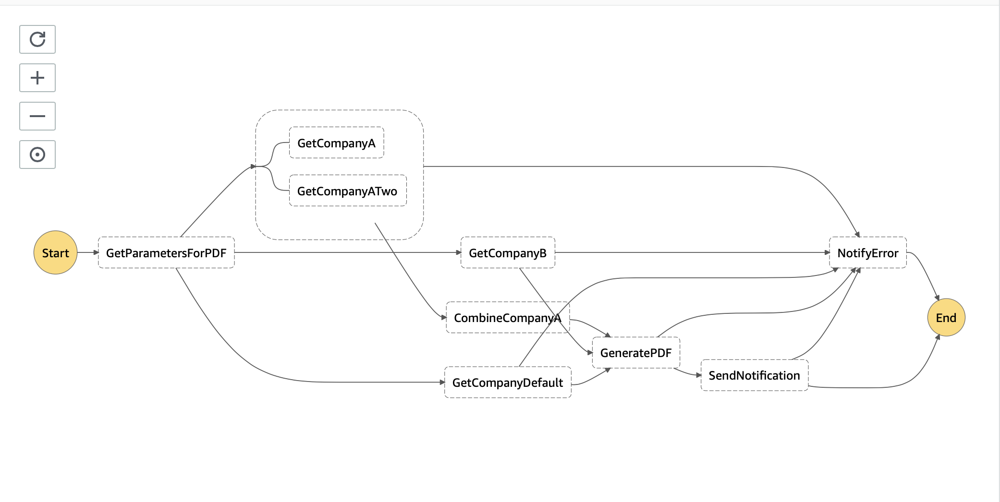

# Barcode Generation Demo 

Full workflow to Generate a Barcode based on some input, and send it back to the client via Websockets.

All Serverless using API Gateway (Websockets, REST), and Step Functions. 

Demonstrated with the use of a quickly generated React Application 

## Websockets:
Uses API Gateways Websocket connections to create a websocket. Uses a client ID to ensure that the websocket connection is retrievable later. 

The client ID used in the web application is a simple UUID but this could be substituted for an actual user id, or for caching purposes a hash of the requested barcode. 

## Step Functions workflow 

The idea behind the step functions would be that as more 'companies' are added you can quickly add new generators. While in this example they are all simplistic (They just send some 'text' parameter) in reality these could be more advanced (for instance, they could make multiple rest calls, and if they failed, could have retry logic built in.)

An Image of the step function workflow is shown below.

### 

* **GetParametersForPDF**: Choice - Routes to Company A, Company B or if neither present, routes to Default.

* **CompanyA/B/Default**: Placesholders, but would be responsible for generating parameters around barcode generation. This could include making rest calls etc. 

* **GeneratePDF**: Generates the Barcode (Using a simple Node Library). Uploads to S3, then sends the URL.

* **SendNotifications**: Uses the URL and ClientID to find a websocket connection, and sends the completed URL back to the client. 

* **NotifyError**: Sends an error back via the websocket connection to the client. 

## Things to note

* Images in S3 are persisted for 1 day before being removed with a lifecycle policy

* DynamoDB uses a TTL to remove websocket connections after 1 hour. We should not need to be connected longer than this

* This is a proof of concept. Error handling and Retries are non-existent.